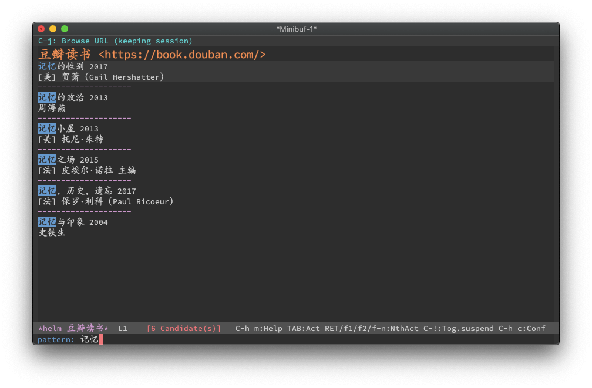

# helm-suggest

Web suggest (autocomplete) with helm. It supports these web sites:

- [百度汉语 - 更懂汉语，更懂你](https://dict.baidu.com/)
- [百度翻译](https://fanyi.baidu.com/)
- [Longman Dictionary of Contemporary English | LDOCE](https://www.ldoceonline.com/)
- [豆瓣读书](https://book.douban.com/)
- [Urban Dictionary, June 10: Bend and Snap](https://www.urbandictionary.com/)

## Usage and screenshot

### `M-x helm-suggest-baidu-dict`

### `M-x helm-suggest-baidu-fanyi`

### `M-x helm-suggest-ldoceonline`

### `M-x helm-suggest-douban-book`

### `M-x helm-suggest-urban`

